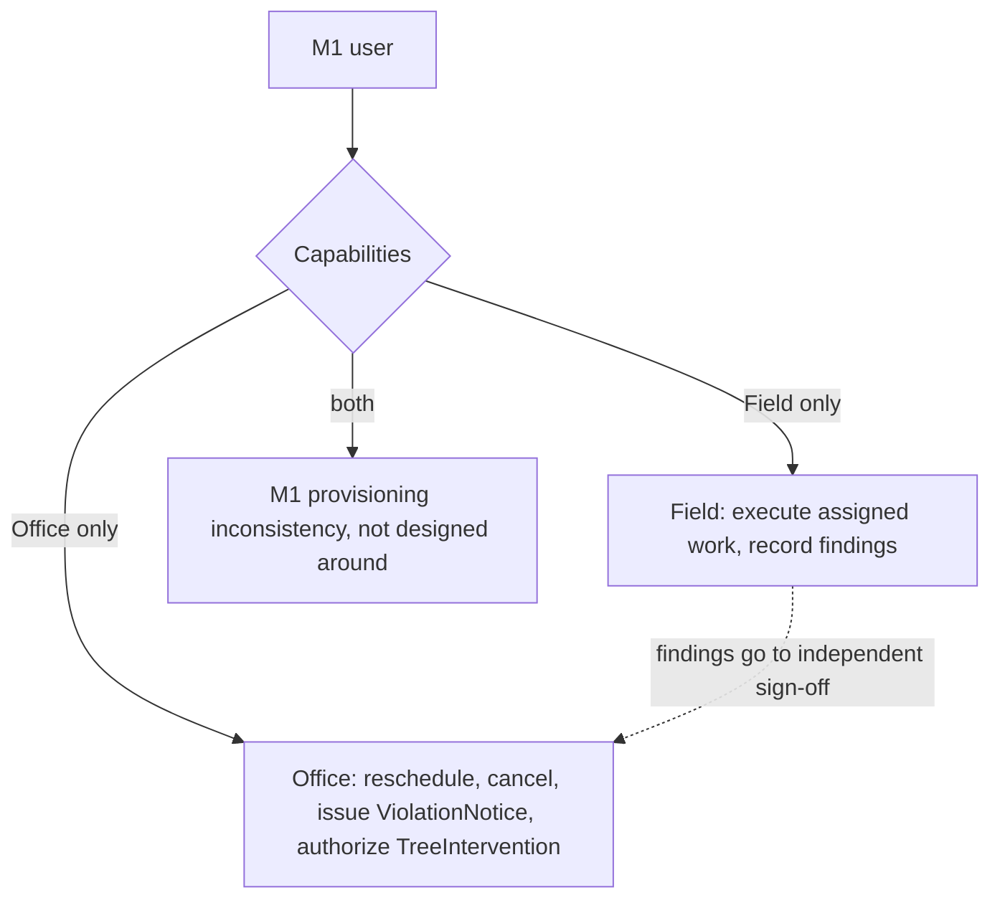

# Office and Field actors are mutually exclusive

M6's elevated Capabilities — Service reschedule/cancellation, ViolationNotice issuance, TreeIntervention authorization — are gated to the Office actor specifically so a Field actor's own work gets an independent sign-off (e.g. an Inspector records findings, but a separate Office actor reviews and issues the ViolationNotice). We considered letting a single M1 user hold both Office and Field capabilities — cheap under the capability-based authorization model, and plausible for smaller crews or dual-role staff — but rejected it: a dual-hat user could authorize or approve their own field work, silently defeating the sign-off gates those Office-only capabilities exist to provide. Office and Field are therefore treated as mutually exclusive: no M6 user is expected to carry both, and an M1 claim asserting both is treated as an M1-side provisioning inconsistency, not a case M6 designs around.

Considered Options: allow a single user to hold both Office and Field capabilities — rejected because it defeats separation of duties on the elevated actions above.

## Diagram

