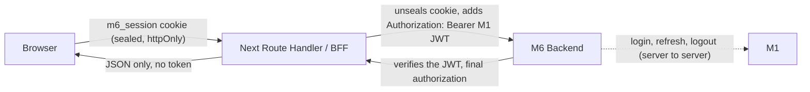

# M6 owns a server-side BFF session; the M1 JWT never reaches the browser

M1 has now published v2 authentication endpoints and confirmed that it emits the user JWT. It still has not published an OAuth2/OIDC-compatible contract: no JWKS or other verification-key distribution, JWT algorithm, issuer/audience, claims shape, exact lifetimes, or refresh-token rotation/revocation behavior. That still rules out adopting Better Auth today. The frontend deploys to Vercel's free serverless tier with no Redis or session store available.

**Implementation status (2026-09-30):** the frontend currently supports `mock` and `backend-development` sessions. `real-m1` deliberately fails closed; there is no M1 login, refresh, or logout integration yet. The `m6_session` cookie is encrypted by the current code with AES-256-GCM using `M6_SESSION_SECRET`; it is a custom sealed-cookie format, not a standards-compliant compact JWE. This note distinguishes the shipped session boundary from the M1 flow selected below.

We chose a Next.js BFF with M6 Backend as its sole module-facing gateway: the browser only talks to Next.js; the BFF calls M6 Backend; and M6 Backend owns the server-to-server adapter to M1 for login, refresh and logout, while independently validating the M1 JWT for domain requests. The target session lives in a sealed, `httpOnly`, `Secure`, `SameSite` cookie holding the original M1 JWT, normalized claims, derived Capabilities, and a `capabilityPolicyVersion` marker (see [ADR-0005](0005-m6-backend-is-the-sole-authorization-authority.md)) — the browser's JavaScript never touches the raw token, and no server-side session store is required. The current mock/development session does not contain M1 claims. CSRF protection relies on `SameSite` plus Next.js's native Origin/Host check on Server Actions; any mutating Route Handler outside that path additionally requires a JSON body and a custom header, neither of which a plain HTML form can produce.

Expiry is `effectiveExpiry = min(jwt.exp, idleExpiry, absoluteExpiry)`: resealing the cookie on activity can extend the idle/absolute windows but never `jwt.exp` itself. M1 now declares a refresh endpoint, so the M1 adapter may atomically replace the access/refresh token before access-token expiry once the exact refresh request and rotation contract are verified; it must never simulate a refresh by only extending the M6 cookie. If refresh is unavailable, fails, or the token is expired, the BFF clears the session and requires login. Route protection is layered: Next.js middleware is an optimistic UX gate only (redirects on a missing/invalid cookie), while the actual authorization check repeats at every Server Action, Route Handler, and data-access call, with M6 Backend as the final authority — nothing relies on middleware or layouts alone for security. Logout clears the session cookie first and broadcasts the event across every open tab via `BroadcastChannel`; M6 Backend then calls M1 logout best-effort. Without a session store there is no M6-side forced revocation or proactive expiry detection in another open tab; that tab notices on its next request.
**Note (2026-09-30):** M6 Backend's deployed JWT verification is still a stopgap, not this ADR's target — HS256 against `JWT_SECRET`, with a required `sub` and `exp` and optional `roles: string[]`; no domain `@Roles()` enforcement is in use. Anyone wiring the BFF to this backend before M1 publishes its contract needs a token in that shape, signed with the shared secret — not an M1 token. **M1 remains the intended source of the user JWT**; the stopgap is expected to be replaced, not treated as a second target contract.

Considered Options:
- Adopt Better Auth now against a best-guess OIDC configuration — rejected: there is no discoverable OIDC/OAuth2 metadata to configure against, and it would mean building against a protocol M1 has never committed to.
- Keep the raw JWT reachable from browser JavaScript (e.g. `localStorage`) so the client attaches it itself — rejected: an unnecessary XSS exposure once a BFF exists to hold the token server-side instead.
- Stand up Redis now for a stateful, revocable session store — rejected as premature infrastructure for a Vercel free-tier deployment; deferred until a real M1 contract demands revocation or refresh semantics a stateless sealed cookie can't provide.

## Diagram

Request path for a domain call. The M1 JWT only exists inside the sealed cookie and the server-side hops.

