> **Espejo de solo lectura**, copiado de `Backend/docs/DER.md` el 2026-09-01. Mantenido acá para tener el modelo de dominio como contexto en el frontend mientras los endpoints reales del backend todavía no están definidos. Ante cualquier discrepancia, el original en el repo `Backend` es la fuente de verdad — no editar este archivo para cambiar el contrato: corregir en `Backend` y volver a copiar.
>
> Fuera de este espejo (no migrado, son de integración backend-a-backend vía bus de eventos, no algo que el frontend consuma): `docs/eventos/`, `docs/bloqueantes.md`, `Acuerdo-Eventos-M6.md`, `Cruce-Eventos-M6.md`.

# DER — Backend Módulo 6 (Ambiente, Higiene y Servicios Urbanos)

Modelo relacional derivado de `docs/entidades/` del Módulo 6. Convenciones aplicadas al pasar del modelo conceptual (documentado) al relacional (implementable):

- **Atributos multivaluados → tablas asociativas.** `zoneIds[]`, `neighborhoodIds[]`, `memberUserIds[]`, `acceptedWasteTypes[]`, `treeIds[]`, `weekdays[]`, `streets[]`, `checklist[]` y `attachments[]` no existen como columnas: cada uno es su propia tabla.
- **IDs externos no son FK.** `ticketId` (M2), `establishmentId` (M4), `organizationId` / `leaderUserId` / `memberUserIds` (M1), `neighborhoodId` (M9) se guardan como referencias sin integridad referencial: viven en otra base. Van marcados `EXT` y con índice, no con `FOREIGN KEY`.
- **Referencias polimórficas** (`targetRef`, `sourceRef`, `detectedIn`) se modelan como par `*_type` + `*_id`, porque apuntan a tablas distintas según el caso.
- **Enums** = los 32 de `enumeraciones.md`. Se implementan como tipo enumerado o `VARCHAR` + `CHECK`, no como tabla de catálogo (son valores cerrados de código, no configurables por el usuario).
- Toda tabla lleva `id UUID PK` y auditoría (`created_at`, `updated_at`, `created_by`); la auditoría no se repite en el diagrama para no ensuciarlo.

## Diagrama

```mermaid
erDiagram
    %% ======== CONFIGURACIÓN Y PLANIFICACIÓN ========
    SERVICE_TYPE {
        uuid id PK
        varchar code UK
        varchar name
        enum category "ServiceCategory"
        enum mode "ServiceMode"
        boolean requires_vehicle
        boolean active
    }
    ZONE {
        uuid id PK
        varchar code UK
        varchar name
        boolean active
    }
    ZONE_NEIGHBORHOOD {
        uuid zone_id PK
        varchar neighborhood_id PK "EXT M9"
    }
    ROUTE {
        uuid id PK
        varchar code UK
        varchar name
        boolean active
    }
    ROUTE_STOP {
        uuid id PK
        uuid route_id FK
        uuid zone_id FK
        int sequence "UK route_id+sequence"
        int estimated_duration_min
    }
    SERVICE_FREQUENCY {
        uuid id PK
        uuid service_type_id FK
        uuid route_id FK
        enum shift "Shift"
        date valid_from
        date valid_to
    }
    FREQUENCY_WEEKDAY {
        uuid frequency_id PK
        smallint weekday PK "1..7"
    }

    %% ======== RECURSOS ========
    CREW {
        uuid id PK
        varchar name
        enum crew_type "CrewType"
        varchar leader_user_id "EXT M1"
        varchar organization_id "EXT M1"
        enum default_shift "Shift"
        boolean active
    }
    CREW_MEMBER {
        uuid crew_id PK
        varchar user_id PK "EXT M1"
    }
    VEHICLE {
        uuid id PK
        varchar plate UK
        enum vehicle_type "VehicleType"
        numeric capacity
        boolean active
    }

    %% ======== EJECUCIÓN ========
    SERVICE {
        uuid id PK
        uuid service_type_id FK
        enum mode "ServiceMode"
        uuid route_id FK "null si POINT"
        varchar target_type "null si ROUTE"
        uuid target_id "polimorfico"
        date scheduled_date
        time window_from
        time window_to
        uuid crew_id FK "null hasta asignar"
        uuid vehicle_id FK
        enum status "ServiceStatus"
        varchar status_reason
        enum origin "ServiceOrigin"
        varchar ticket_id "EXT M2"
        varchar public_id "EXT M2"
        int ticket_version "EXT M2"
        text notes
    }
    SERVICE_ZONE {
        uuid service_id PK
        uuid zone_id PK
        int sequence "snapshot del Route"
    }
    ZONE_RESULT {
        uuid id PK
        uuid service_id FK
        uuid zone_id FK "UK service_id+zone_id"
        enum status "ZoneResultStatus"
        enum reason "NotServicedReason"
        date proposed_date
        text notes
        timestamp recorded_at
    }
    COLLECTION_RECORD {
        uuid id PK
        uuid service_id FK
        uuid zone_result_id FK "null si POINT"
        uuid disposal_site_id FK
        enum waste_type "WasteType"
        numeric volume_m3
        numeric weight_kg
    }
    DISPOSAL_SITE {
        uuid id PK
        varchar code UK
        varchar name
        enum site_type "DisposalSiteType"
    }
    ATTACHMENT {
        uuid id PK
        varchar owner_type "SERVICE ZONE_RESULT INSPECTION"
        uuid owner_id "polimorfico"
        varchar url
        varchar filename
        timestamp uploaded_at
    }

    %% ======== INVENTARIO URBANO ========
    CONTAINER {
        uuid id PK
        varchar code UK
        enum container_type "ContainerType"
        uuid zone_id FK
        varchar address
        numeric lat
        numeric lng
        int capacity_liters
        enum status "ContainerStatus"
        enum damage_type "solo DAMAGED"
        enum severity "solo DAMAGED"
        boolean requires_public_works "solo DAMAGED"
    }
    GREEN_POINT {
        uuid id PK
        varchar code UK
        varchar name
        uuid zone_id FK
        varchar address
        numeric lat
        numeric lng
        boolean active
    }
    GREEN_POINT_WASTE_TYPE {
        uuid green_point_id PK
        enum waste_type PK "WasteType"
    }
    TREE {
        uuid id PK
        varchar survey_code UK
        varchar species
        uuid zone_id FK
        varchar address
        numeric lat
        numeric lng
        numeric height_m
        numeric diameter_cm
        boolean active
    }
    TREE_SURVEY {
        uuid id PK
        uuid tree_id FK
        timestamp surveyed_at
        varchar inspector_id "EXT M1"
        enum health_status "TreeHealthStatus"
        enum risk_level "RiskLevel"
        enum risk_type "RiskType"
        enum suggested_intervention "TreeInterventionType"
        boolean requires_street_closure
        boolean requires_public_works
        text notes
    }
    TREE_INTERVENTION {
        uuid id PK
        enum intervention_type "TreeInterventionType"
        uuid service_id FK "null hasta programar"
        varchar address
        boolean requires_street_closure
        enum status "TreeInterventionStatus"
        enum priority "Severity"
        varchar authorized_by_user_id "solo REMOVAL"
        timestamp authorized_at "solo REMOVAL"
        text justification "solo REMOVAL"
    }
    INTERVENTION_TREE {
        uuid intervention_id PK
        uuid tree_id PK
    }
    GREEN_SPACE {
        uuid id PK
        varchar name
        enum space_type "GreenSpaceType"
        uuid zone_id FK
        numeric area_m2
        boolean active
    }

    %% ======== CONTROL AMBIENTAL ========
    ENVIRONMENTAL_REPORT {
        uuid id PK
        enum report_type "EnvironmentalReportType"
        varchar address
        numeric lat
        numeric lng
        varchar ticket_id "EXT M2"
        jsonb reporter_snapshot
        enum status "EnvironmentalReportStatus"
        enum priority "Severity"
        timestamp deadline_at "cierre por vencimiento"
    }
    ENVIRONMENTAL_INSPECTION {
        uuid id PK
        uuid report_id FK
        uuid service_id FK
        varchar inspector_id "EXT M1 - interno"
        timestamp inspected_at
        text findings "interno"
        enum outcome "InspectionOutcome"
        enum next_step "InspectionNextStep"
    }
    CHECKLIST_ITEM {
        uuid id PK
        uuid inspection_id FK
        varchar item_code
        varchar label
        boolean result
        text observations
    }
    VIOLATION_NOTICE {
        uuid id PK
        varchar notice_number UK
        uuid inspection_id FK "UK - inmutable"
        timestamp issued_at
        varchar establishment_id "EXT M4 - obligatorio"
        enum violation_type "ViolationType"
        enum severity "Severity"
        enum suggested_action "SuggestedAction - no vinculante"
        int prior_notice_count
    }
    SANCTION_OUTCOME {
        uuid id PK
        uuid violation_notice_id FK "UK - solo lectura"
        enum decision "SanctionDecision"
        timestamp decided_at
        varchar external_ref "EXT M4"
        text dismissal_reason
    }

    %% ======== DERIVACIONES SALIENTES ========
    REPAIR_REQUEST {
        uuid id PK
        enum damage_type "RepairDamageType"
        enum severity "Severity"
        varchar address
        varchar detected_in_type "SERVICE INSPECTION"
        uuid detected_in_id "polimorfico"
        varchar status "REQUESTED IN_PROGRESS CLOSED"
        varchar work_order_id "EXT M3"
        timestamp requested_at
    }
    STREET_CLOSURE_REQUEST {
        uuid id PK
        varchar reason
        varchar source_type "SERVICE TREE_INTERVENTION"
        uuid source_id "polimorfico"
        enum closure_type "StreetClosureType"
        timestamp closure_from
        timestamp closure_to
        varchar status "REQUESTED APPROVED REJECTED ENDED"
        varchar closure_id "EXT M7"
    }
    CLOSURE_STREET {
        uuid id PK
        uuid request_id FK
        varchar street_name
        varchar from_cross
        varchar to_cross
    }

    %% ======== INTEGRACIÓN (técnico, no de dominio) ========
    OUTBOX_EVENT {
        uuid id PK
        varchar event_type
        varchar aggregate_type
        uuid aggregate_id
        jsonb payload
        varchar status "PENDING SENT FAILED"
        timestamp occurred_at
        timestamp published_at
    }
    INBOX_EVENT {
        uuid id PK
        varchar message_id UK "idempotencia"
        varchar event_type
        jsonb payload
        timestamp received_at
        timestamp processed_at
    }

    %% ======== RELACIONES ========
    ZONE              ||--o{ ZONE_NEIGHBORHOOD : agrupa
    ROUTE             ||--|{ ROUTE_STOP : ordena
    ZONE              ||--o{ ROUTE_STOP : "es parada de"
    SERVICE_TYPE      ||--o{ SERVICE_FREQUENCY : programa
    ROUTE             ||--o{ SERVICE_FREQUENCY : "se repite en"
    SERVICE_FREQUENCY ||--|{ FREQUENCY_WEEKDAY : "corre los"

    CREW              ||--o{ CREW_MEMBER : integra
    SERVICE_TYPE      ||--o{ SERVICE : tipifica
    ROUTE             ||--o{ SERVICE : "recorre en ROUTE"
    CREW              ||--o{ SERVICE : ejecuta
    VEHICLE           ||--o{ SERVICE : "se asigna a"

    SERVICE           ||--|{ SERVICE_ZONE : "cubre (snapshot)"
    ZONE              ||--o{ SERVICE_ZONE : "es cubierta por"
    SERVICE           ||--o{ ZONE_RESULT : "resulta en"
    ZONE              ||--o{ ZONE_RESULT : "se reporta en"
    SERVICE           ||--o{ COLLECTION_RECORD : registra
    ZONE_RESULT       ||--o{ COLLECTION_RECORD : detalla
    DISPOSAL_SITE     ||--o{ COLLECTION_RECORD : recibe

    ZONE              ||--o{ CONTAINER : ubica
    ZONE              ||--o{ GREEN_POINT : ubica
    ZONE              ||--o{ TREE : ubica
    ZONE              ||--o{ GREEN_SPACE : ubica
    GREEN_POINT       ||--o{ GREEN_POINT_WASTE_TYPE : acepta
    TREE              ||--o{ TREE_SURVEY : "tiene historial de"
    TREE_INTERVENTION ||--|{ INTERVENTION_TREE : "interviene sobre"
    TREE              ||--o{ INTERVENTION_TREE : "es intervenido en"
    SERVICE           ||--o| TREE_INTERVENTION : "ejecuta el cuando de"

    ENVIRONMENTAL_REPORT     ||--o{ ENVIRONMENTAL_INSPECTION : "se inspecciona en"
    SERVICE                  ||--o| ENVIRONMENTAL_INSPECTION : "ejecuta el cuando de"
    ENVIRONMENTAL_INSPECTION ||--o{ CHECKLIST_ITEM : verifica
    ENVIRONMENTAL_INSPECTION ||--o| VIOLATION_NOTICE : "constata en"
    VIOLATION_NOTICE         ||--o| SANCTION_OUTCOME : "es resuelta por"

    STREET_CLOSURE_REQUEST ||--|{ CLOSURE_STREET : corta
```

## Decisiones de modelado que no son obvias

| # | Decisión | Por qué |
|---|---|---|
| 1 | `SERVICE_ZONE` existe aunque `mode = POINT` tenga una sola zona | El doc dice que `zoneIds[]` **nunca viene vacío** y que se copia al programar sin recalcular. Es un *snapshot*: editar un `Route` después no puede alterar lo ya ejecutado, así que no se puede derivar de `ROUTE_STOP` en tiempo de consulta |
| 2 | `SERVICE.target_type` + `target_id` en vez de cuatro FK nullables | `targetRef` apunta a `CONTAINER`, `GREEN_POINT`, `TREE`, `GREEN_SPACE` o a una dirección suelta. Cuatro FK nullables con un `CHECK` de exclusividad también sirve y da integridad referencial real: es la alternativa si se prioriza el motor sobre el ORM |
| 3 | `TREE_INTERVENTION.service_id` y `ENVIRONMENTAL_INSPECTION.service_id`, no al revés | El `Service` guarda *cuándo y con quién*; la intervención/inspección guarda *qué*. La FK va del lado que sabe qué servicio lo ejecuta, y es nullable porque la intervención existe antes de programarse (`REQUESTED`, `PENDING_AUTHORIZATION`) |
| 4 | `VIOLATION_NOTICE` 1:1 con la inspección y sin `UPDATE` | Acta inmutable: si hay error se emite otra. En la práctica: sin endpoint de edición, y con trigger o permiso que bloquee `UPDATE`/`DELETE` |
| 5 | `SANCTION_OUTCOME` separado del acta | Es espejo de solo lectura de lo que decide M4. Separarlo deja explícito que ese registro no lo escribe nuestro dominio sino el consumidor de eventos |
| 6 | `ENVIRONMENTAL_REPORT.deadline_at` (campo agregado) | El paso `NOTICE_ISSUED → CLOSED` por vencimiento de plazo es diseño explícito, no atajo. Necesita una fecha materializada para que un job la barra; no está en el doc porque el doc modela el *qué*, no el *cómo* |
| 7 | `damage_type`, `severity`, `requires_public_works` como columnas nullables en `CONTAINER` | Solo se llenan en `DAMAGED`. La alternativa (tabla `CONTAINER_DAMAGE` con historial) es mejor si se quiere saber cuántas veces se rompió un contenedor: hoy el doc no lo pide |
| 8 | `OUTBOX_EVENT` / `INBOX_EVENT` | No son dominio, pero el módulo publica 8 eventos y consume 12. Sin outbox transaccional, un commit que falla al publicar deja el estado y el bus desincronizados; sin inbox con `message_id` único, un evento reentregado por M4 duplica el `SANCTION_OUTCOME` |
| 9 | Los enums viven en el código, no en tablas de catálogo | Son valores cerrados versionados con el código (32 en total). `SERVICE_TYPE` y `ZONE` sí son tablas: esos los configura el municipio |

## Riesgos abiertos que impactan el esquema

Salen de `bloqueantes.md` (repo Backend) y de las divergencias de enums. Ninguno bloquea empezar, pero conviene tenerlos a la vista antes de escribir la primera migración:

- **`sourceViolationId` que M4 no devuelve.** Sin ese campo en `commercialFineGenerated` / `closureOrdered` / `closureLifted` no se sabe a qué acta corresponde la resolución, y `SANCTION_OUTCOME` nunca se llena. El esquema soporta el caso (el expediente cierra por `deadline_at`), pero el dato se pierde.
- **`sourceRequestId` de M3 y M7.** Mismo problema en `REPAIR_REQUEST` y `STREET_CLOSURE_REQUEST`: las columnas `work_order_id` / `closure_id` existen para correlacionar, pero hoy la respuesta no trae con qué llenarlas.
- **Catálogo de barrios de M9 sin exponer.** `ZONE_NEIGHBORHOOD.neighborhood_id` queda como `VARCHAR` sin validación hasta que se conozca el formato del ID.
- **Divergencias 2 a 5 de enums** (`ServiceOrigin`, `TreeHealthStatus`, `TreeInterventionType`, `SuggestedAction`). Como esos valores viajan al bus, elegir mal implica migrar datos y no solo cambiar una constante: conviene cerrarlas antes de la primera migración.
- **Colisión del nombre `Zone` con M9.** Si M9 se queda con la palabra, el rename es de tabla y de API. Mejor decidirlo antes que después.
