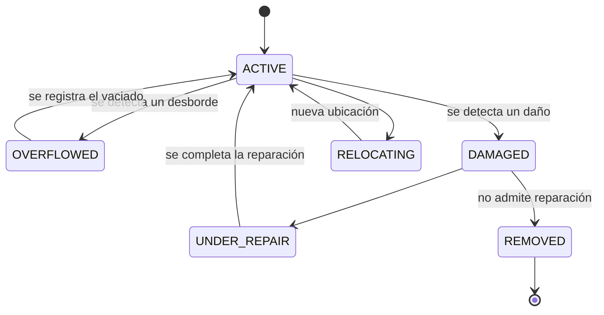

# `Container` — contenedores

Los contenedores de la vía pública, con su ciclo de desborde, daño, reparación y reubicación. Los puntos verdes de entrega voluntaria (`GreenPoint`) son otra cosa y están en [inventario-urbano.md](inventario-urbano.md).

## Campos

| Entidad | Campos principales |
|---|---|
| `Container` | `code`, `containerType`, `location`, `capacityLiters`, `zoneId`, `status`, y con el estado `DAMAGED` también `damageType`, `severity`, `requiresPublicWorks` |

Enums: `containerType` es `ContainerType`, `status` es `ContainerStatus`, `damageType` es `DamageType`, `severity` es `Severity` — ver [enumeraciones.md](../enumeraciones.md). `zoneId` → [`Zone`](configuracion-y-recursos.md#zone).

Los tres campos de daño se llenan solo al pasar a `DAMAGED`. **`requiresPublicWorks = true` marca el componente de infraestructura civil que no nos corresponde** —la base rota, la vereda hundida— y es la señal que hace que el evento le sirva a M3.

## Estados

El vaciado y la reubicación se ejecutan como [`Service`](service.md) con `mode = POINT` y `targetRef` apuntando al contenedor.

## Qué publica

- Al pasar a `DAMAGED`: [`containerDamaged`](../eventos/publicados/containerDamaged.md) → M3.
- Al pasar a `OVERFLOWED`: **nada sale al bus** (`containerOverflowed` está [descartado](../eventos/publicados/descartados.md)). Si el desborde lo reportó un vecino hay `ticketId` y sale un [`updateTicketStatus`](../eventos/publicados/updateTicketStatus.md) hacia M2; si lo detectamos nosotros en la recorrida, no hay reclamo al que contestarle y no sale nada.
