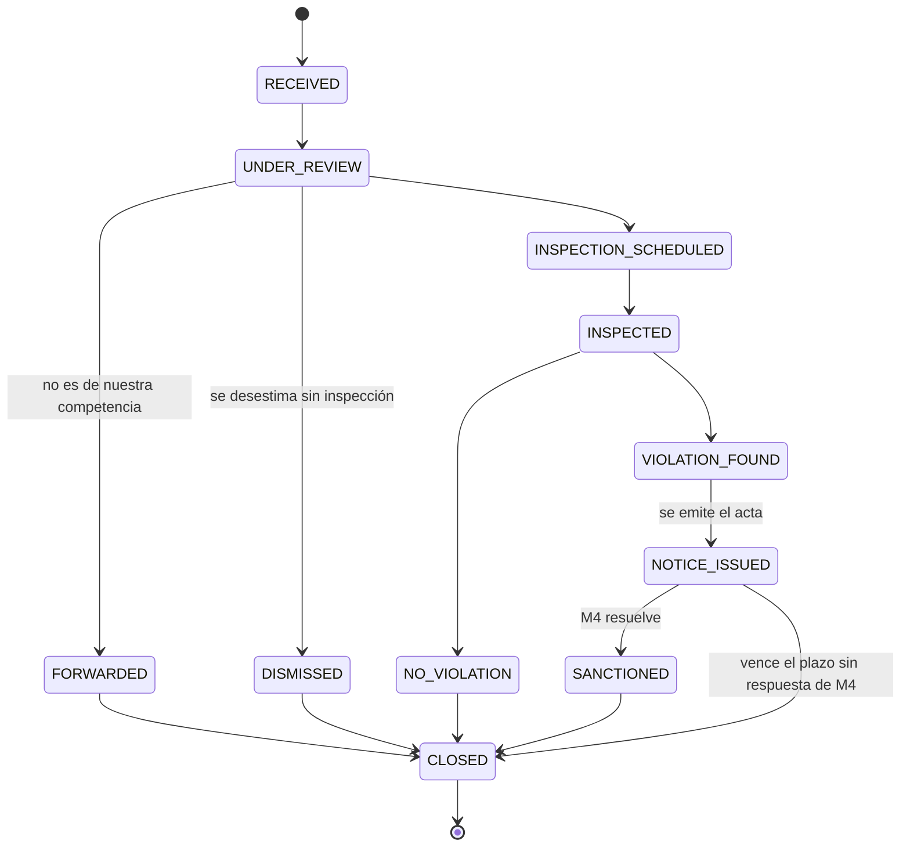

# `EnvironmentalReport` — el expediente ambiental

La denuncia ambiental tal como la tramitamos nosotros: ruidos, vertidos, microbasurales, emisiones. Puede nacer de un reclamo de M2 (`ticketId` presente) o de una detección de oficio del inspector.

> **No confundir con el expediente digital de M1** (`caseFile`). En prosa se parecen; en código no, porque los nombres técnicos son distintos. El acta que emitimos **no** va al expediente digital — ver [bloqueantes.md](../bloqueantes.md#m1--ciudadanos--sin-eventos).

## Campos

| Entidad | Campos principales |
|---|---|
| `EnvironmentalReport` | `reportType`, `location`, `ticketId`, `reporterSnapshot`, `status`, `priority` |

Enums: `reportType` es `EnvironmentalReportType`, `status` es `EnvironmentalReportStatus` — ver [enumeraciones.md](../enumeraciones.md).

La inspección, el acta y la resolución de M4 son entidades aparte: ver [control-ambiental.md](control-ambiental.md).

## Estados

**`NOTICE_ISSUED → CLOSED` por vencimiento de plazo no es un atajo, es el diseño.** M4 no publica ningún evento cuando decide que no corresponde castigo, así que sin ese cierre el expediente quedaría abierto para siempre. Cierra sin `SanctionOutcome`: una desestimación y una demora de M4 se ven igual, y esa imprecisión se aceptó a cambio de no depender de que otro grupo agregue un evento. Ver [bloqueantes.md](../bloqueantes.md#resueltos--no-repreguntar).

## Qué publica y qué consume

- Al emitirse el acta: [`environmentalViolationDetected`](../eventos/publicados/environmentalViolationDetected.md) → M4.
- Si hay `ticketId`, cada tramo dispara un [`updateTicketStatus`](../eventos/publicados/updateTicketStatus.md) → M2. La transición a `DISMISSED` sale como `REJECTED`; un reclamo que no es de nuestra área sale como `RETURNED`, que es distinto.
- Pasa a `SANCTIONED` al recibir [`commercialFineGenerated`](../eventos/consumidos/commercialFineGenerated.md), [`closureOrdered`](../eventos/consumidos/closureOrdered.md) o [`closureLifted`](../eventos/consumidos/closureLifted.md) de M4.
- `INSPECTION_SCHEDULED` e `INSPECTED` **no** se publican: eran los descartados `environmentalInspectionScheduled` y `environmentalInspectionCompleted`.
