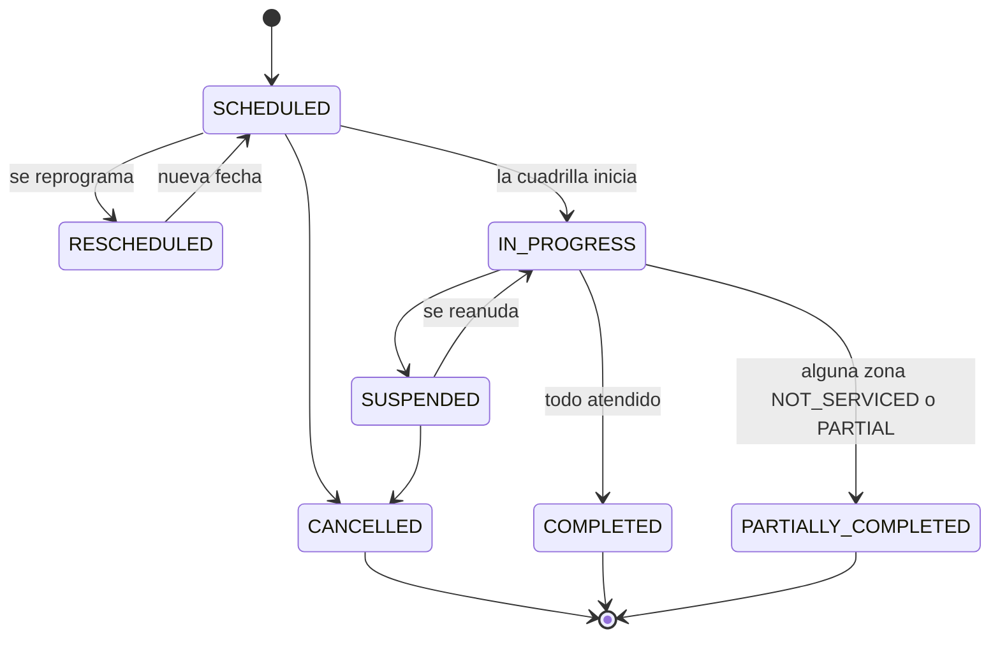

# `Service` — la entidad central

Un **`Service`** es toda unidad de trabajo programable del módulo: siempre tiene tipo, fecha, ventana horaria, cuadrilla, vehículo si corresponde, estado y evidencia. Lo que varía es sobre qué se ejecuta.

| `mode` | Objetivo | Ejemplo | Resultado |
|---|---|---|---|
| `ROUTE` | Secuencia ordenada de zonas | Recolección domiciliaria Zona Norte | Un `ZoneResult` por zona |
| `POINT` | Un bien del inventario o una ubicación | Vaciar el contenedor CT-0442; podar el árbol TR-01293 | Un único resultado |

Todo `Service` lleva `zoneIds[]` y **nunca viene vacío**: las zonas del recorrido en `ROUTE`, una sola en `POINT`. Se copia al programar y no se recalcula, para que editar un recorrido no altere lo ya ejecutado.

En `POINT` la zona sale del bien del inventario, o del barrio de la dirección si el objetivo es una ubicación suelta.

Las podas y las inspecciones ambientales también son servicios: [`TreeIntervention`](tree-intervention.md) y [`EnvironmentalInspection`](control-ambiental.md) guardan **qué** hay que hacer, y el `Service` **cuándo**, con qué cuadrilla y cómo terminó.

## Campos

| Entidad | Campos principales |
|---|---|
| `Service` | `serviceTypeId`, `mode`, `zoneIds[]`, `routeId` \| `targetRef`, `scheduledDate`, `timeWindow`, `crewId`, `vehicleId`, `status`, `statusReason`, `origin`, `ticketId`, `attachments[]`, `notes`. `crewId` es opcional hasta que se asigna la cuadrilla |
| `ZoneResult` | Hijo de un `Service` con `mode = ROUTE`, uno por zona. `zoneId`, `status`, `reason`, `proposedDate`, `notes`, `attachments[]`, `recordedAt` |
| `CollectionRecord` | `wasteType`, `volumeM3`, `weightKg`, `disposalSiteId` |
| `DisposalSite` | `code`, `siteType`, `name` |

Referencias a otras entidades: `serviceTypeId` → [`ServiceType`](configuracion-y-recursos.md#servicetype), `routeId` → [`Route`](configuracion-y-recursos.md#route), `crewId` → [`Crew`](configuracion-y-recursos.md#crew), `vehicleId` → [`Vehicle`](configuracion-y-recursos.md#vehicle), `zoneIds[]` → [`Zone`](configuracion-y-recursos.md#zone). `targetRef` apunta a un bien de [inventario urbano](inventario-urbano.md) o a un [`Container`](container.md).

Enums: `mode` es `ServiceMode`, `status` es `ServiceStatus`, `origin` es `ServiceOrigin`, `ZoneResult.status` es `ZoneResultStatus`, `ZoneResult.reason` es `NotServicedReason`, `wasteType` es `WasteType`, `siteType` es `DisposalSiteType` — ver [enumeraciones.md](../enumeraciones.md).

`ticketId` es de M2 y viaja solo cuando `origin = TICKET`. Es lo único que necesitamos guardar para correlacionar: la v1.5 sacó `publicId` y `expectedTicketVersion` del contrato, así que no hace falta persistir `ticketVersion` (ver [`updateTicketStatus`](../eventos/publicados/updateTicketStatus.md)).

## Estados

El mismo diagrama vale para `mode = ROUTE` y para `mode = POINT`.

`DELAYED` **no es un estado**: es un aviso puntual. El hecho interno `urbanServiceDelayed` ocurre una vez y el servicio sigue en `SCHEDULED` o `IN_PROGRESS`.

## Qué publica

- Al agendarse: [`urbanServiceScheduled`](../eventos/publicados/urbanServiceScheduled.md) → M7.
- Si nació de un reclamo (`origin = TICKET`), cada cambio relevante dispara un [`updateTicketStatus`](../eventos/publicados/updateTicketStatus.md) → M2. **Si no hay `ticketId`, no sale nada hacia M2**: un servicio planificado —la recolección de todos los martes— no proyecta.

Los hechos de inicio, demora, cierre y zona no atendida existen en el modelo pero **no salen al bus**: ver [descartados.md](../eventos/publicados/descartados.md).
