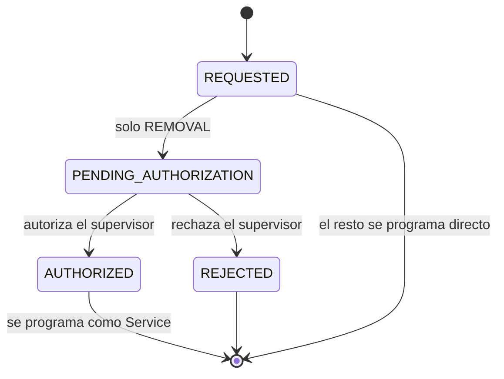

> **Espejo de solo lectura**, copiado de `Backend/docs/entidades/tree-intervention.md` el 2026-09-01. Ante cualquier discrepancia, el original en el repo `Backend` es la fuente de verdad. Fuera de este espejo: `docs/eventos/`, `docs/bloqueantes.md`.

# `TreeIntervention` — poda, extracción, plantación, tratamiento

Qué hay que hacerle a uno o varios árboles. El **cuándo** y el **con qué cuadrilla** los pone el [`Service`](service.md) que la ejecuta: la intervención guarda la decisión, el servicio guarda la ejecución.

El árbol y su historial de relevamientos están en [inventario-urbano.md](inventario-urbano.md).

## Campos

| Entidad | Campos principales |
|---|---|
| `TreeIntervention` | `interventionType`, `treeIds[]`, `location`, `requiresStreetClosure`, `status`, `priority`, `serviceId`, y en las extracciones `authorizedByUserId`, `authorizedAt`, `justification` |

Enums: `interventionType` es `TreeInterventionType`, `status` es `TreeInterventionStatus` — ver [enumeraciones.md](../enumeraciones.md). Ojo con la [divergencia 4](../enumeraciones.md#divergencias-con-el-acuerdo-publicado): el acuerdo publicado usa otros valores para `interventionType`.

## Estados

La extracción necesita autorización; el resto no.

Los tres campos de autorización (`authorizedByUserId`, `authorizedAt`, `justification`) se llenan solo en el camino `REMOVAL`. El estado terminal no es "hecho": la intervención sale de esta máquina al programarse, y a partir de ahí el estado que importa es el del [`Service`](service.md#estados).

## Qué publica

- Al programarse la poda: `treePruningScheduled` → M7 (ver `docs/eventos/` en el repo Backend).
- Si `requiresStreetClosure = true`, además sale `streetClosureRequested` → M7, con `sourceRef` apuntando a esta intervención. M7 recibe primero el aviso de la poda y después la solicitud de corte.
