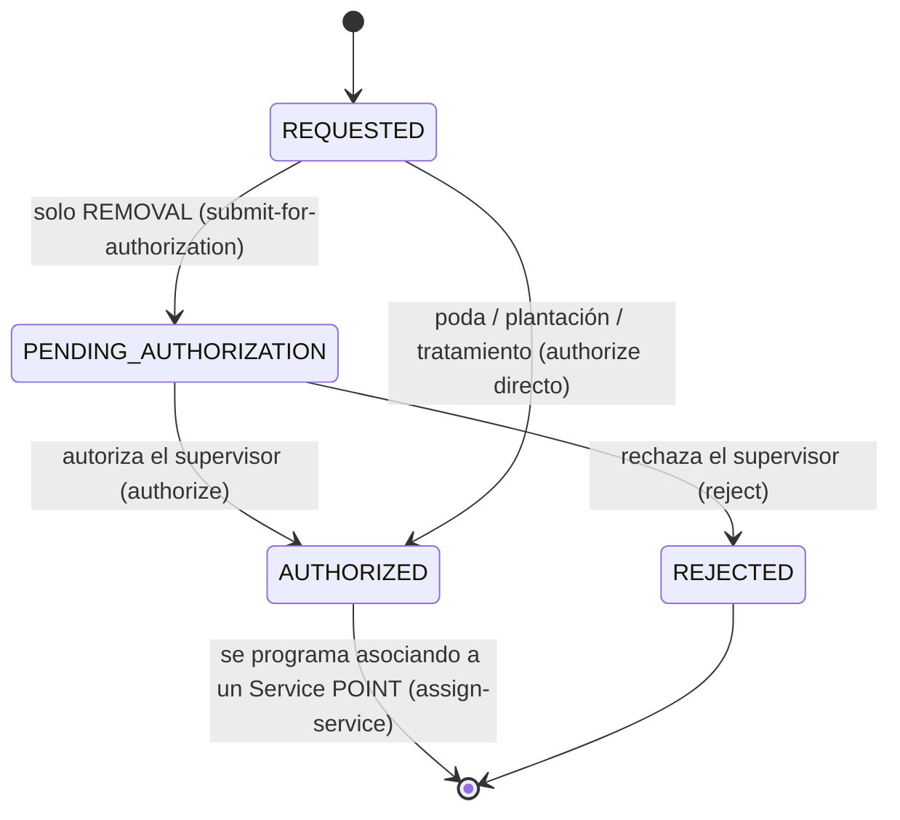

# `TreeIntervention` — poda, extracción, plantación, tratamiento

Qué hay que hacerle a uno o varios árboles. El **cuándo** y el **con qué cuadrilla** los pone el [`Service`](service.md) que la ejecuta: la intervención guarda la decisión, el servicio guarda la ejecución.

El árbol y su historial de relevamientos están en [inventario-urbano.md](inventario-urbano.md).

## Campos

| Entidad | Campos principales |
|---|---|
| `TreeIntervention` | `interventionType`, `treeIds[]`, `location`, `requiresStreetClosure`, `status`, `priority`, `serviceId`, y en las extracciones `authorizedByUserId`, `authorizedAt`, `justification` |

Enums: `interventionType` es `TreeInterventionType`, `status` es `TreeInterventionStatus` — ver [enumeraciones.md](../enumeraciones.md). La [divergencia 4](../enumeraciones.md#divergencias-con-el-acuerdo-publicado--resueltas) sobre `interventionType` quedó resuelta a favor del catálogo ([ADR-003](../decisiones/adr-003-divergencias-enums.md)).

## Estados

Toda intervención debe alcanzar el estado `AUTHORIZED` antes de poder asociarse a un [`Service`](service.md) de modo `POINT` mediante `POST /tree-interventions/:id/assign-service`. La extracción (`REMOVAL`) exige un paso intermedio de supervisión obligatoria (`PENDING_AUTHORIZATION`) con justificación; el resto de intervenciones pasa directo de `REQUESTED` a `AUTHORIZED`.

Los campos de auditoría de autorización (`authorizedByUserId`, `authorizedAt`) se registran al pasar a `AUTHORIZED`. `justification` es obligatoria para `REMOVAL`. El estado terminal de esta entidad es quedar asociada a un servicio (`serviceId` asignado); a partir de ahí el avance operativo se sigue desde el [`Service`](service.md#estados).

## Qué publica

- Al programarse la poda: [`treePruningScheduled`](../eventos/publicados/treePruningScheduled.md) → M7.
- Si `requiresStreetClosure = true`, además sale [`streetClosureRequested`](../eventos/publicados/streetClosureRequested.md) → M7, con `sourceRef` apuntando a esta intervención. M7 recibe primero el aviso de la poda y después la solicitud de corte.
