# UI inspiration catalog

Reference material for the M6 visual world, gathered for [Wayfinder ticket #14](https://github.com/hllous/Frontend-M6-DAPS2/issues/14) ("Prototype the responsive map-and-table operations workspace"), part of the [map](https://github.com/hllous/Frontend-M6-DAPS2/issues/6). Mostly sourced from [21st.dev](https://21st.dev). Nothing here is meant to be copied verbatim — it's borrowed structure, patterns, and materials, recomposed into M6's own institutional-civic direction (see [DESIGN.md](../../../DESIGN.md) once it exists, and `PRODUCT.md`'s Brand Commitments for the pinned palette/type).

Each entry: what it is, what to **borrow**, what to **avoid**, and where it's likely to land in M6.

## Palette and type (pinned — treat as settled, not up for the direction roll)

- **Navy (institutional)** `#0F2C59`, light variant `#163D75` — primary color: dark surfaces, headings, primary buttons, navbar.
- **Coral (accent)** `#D63031`, light variant `#E74C3C` — accent only: CTAs, alerts, destructive/urgent emphasis. Not a base color.
- **Ground** `#FAFAFA` — page background (off-white, low eye strain for dense operational screens).
- **Card surface** `#FFFFFF` with a soft `border-neutral-200` border.
- **Text** `#1A1A1A` primary, `#525252` secondary.
- **Type**: Inter, weights 400/500/600/700/800, `system-ui, -apple-system, "Segoe UI", Roboto, sans-serif` fallback stack.

```css
@import "tailwindcss";

@theme {
  --color-navy: #0F2C59;
  --color-navy-light: #163d75;
  --color-coral: #D63031;
  --color-coral-light: #e74c3c;
  --font-sans: "Inter", system-ui, -apple-system, "Segoe UI", Roboto, sans-serif;
}

body {
  margin: 0;
  font-family: var(--font-sans);
  background: #fafafa;
  color: #1a1a1a;
}
```

This is a **restrained** color strategy (neutrals plus one accent), which fits an Operate-mode, information-dense civic-ops product — task legibility outranks expression. Navy carries structural weight (nav, headers, primary actions); coral is reserved for things that need to interrupt (alerts, overdue/urgent states, destructive actions) — it should never become a second base color.

## Dashboards

### [`dashboard-1.png`](dashboard-1.png) — "Shopeers" admin dashboard
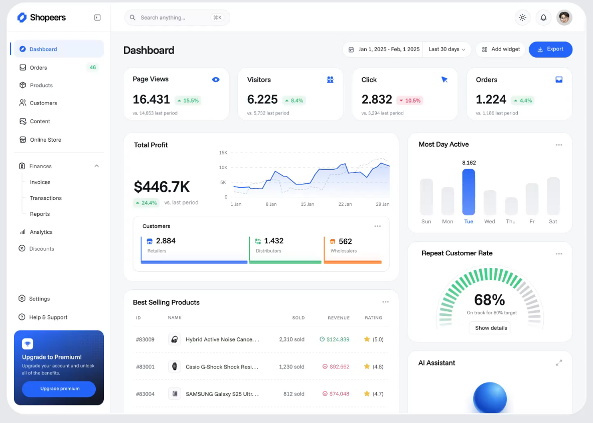

Light sidebar + top-stat-row + mixed chart/table dashboard.

- **Borrow**: the 4-up KPI stat-card row at the top (label, big number, colored trend badge); collapsible nav section ("Finances" expands into Invoices/Transactions/Reports) for grouping related routes; the data table pattern in "Best Selling Products" (avatar/icon + id + name + right-aligned numeric columns + rating) — a strong precedent for a Servicios/Inventario row; the radial/donut gauge ("Repeat Customer Rate — 68%, on track for target") as a completion-rate or capacity gauge (e.g. Crew load, Service completion rate).
- **Avoid**: e-commerce-specific copy and iconography; the "Upgrade to Premium" promo card and floating "AI Assistant" blob — off-brand for an internal municipal tool, no upsell surface exists in M6.
- **Likely landing spot**: Tableros (dashboards) KPI row + gauge; Servicios/Inventario list row structure.

### [`dashboard-2.png`](dashboard-2.png) — "Interactive Demos" analytics view
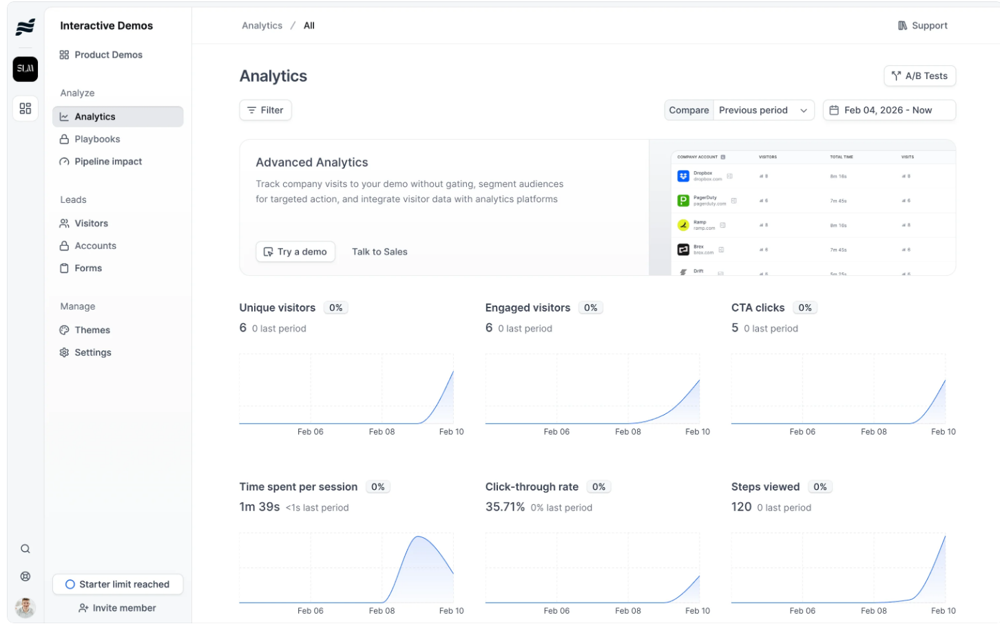

Minimal icon-rail sidebar, breadcrumb header, filter/compare/date-range toolbar, grid of small sparkline stat cards.

- **Borrow**: the toolbar row — breadcrumb + `Filter` + `Compare: Previous period` + date-range picker in one line — is a near-direct fit for filtering/comparing Services by date range; the compact stat-card grid with an inline `0%` delta badge next to the label and a small sparkline underneath, good for a denser alternative to dashboard-1's bigger KPI cards.
- **Avoid**: the "Advanced Analytics" upsell banner with embedded mini-table and "Try a demo" CTA — marketing chrome, not operational UI.
- **Likely landing spot**: Tableros toolbar (filter/compare/date range); compact KPI variant for narrower panels.

## Navigation

### [`sidebar-1.png`](sidebar-1.png) — dark org-switcher sidebar
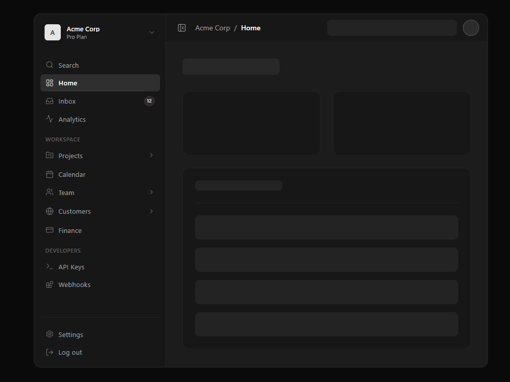

- **Borrow**: org/workspace switcher at the top (adaptable to an Office/Field context switcher or facility picker); uppercase section labels grouping nav items (`WORKSPACE`, `DEVELOPERS`) — maps to M6's own IA groups; numeric badge on a nav item (`Inbox 12`) — good for pending-exception or unread-notice counts; settings/logout pinned to the bottom, separated by a divider.
- **Avoid**: dark-only chrome (M6's pinned palette is a light `#FAFAFA` ground with navy as a structural accent, not a black app shell); `API Keys`/`Webhooks`/developer-facing items, irrelevant to M6 actors.
- **Likely landing spot**: primary sidebar structure (grouped sections, badge counts, bottom-pinned account actions), recolored to the navy/light palette.

### [`sidebar-2.png`](sidebar-2.png) — two-tier icon-rail + panel sidebar
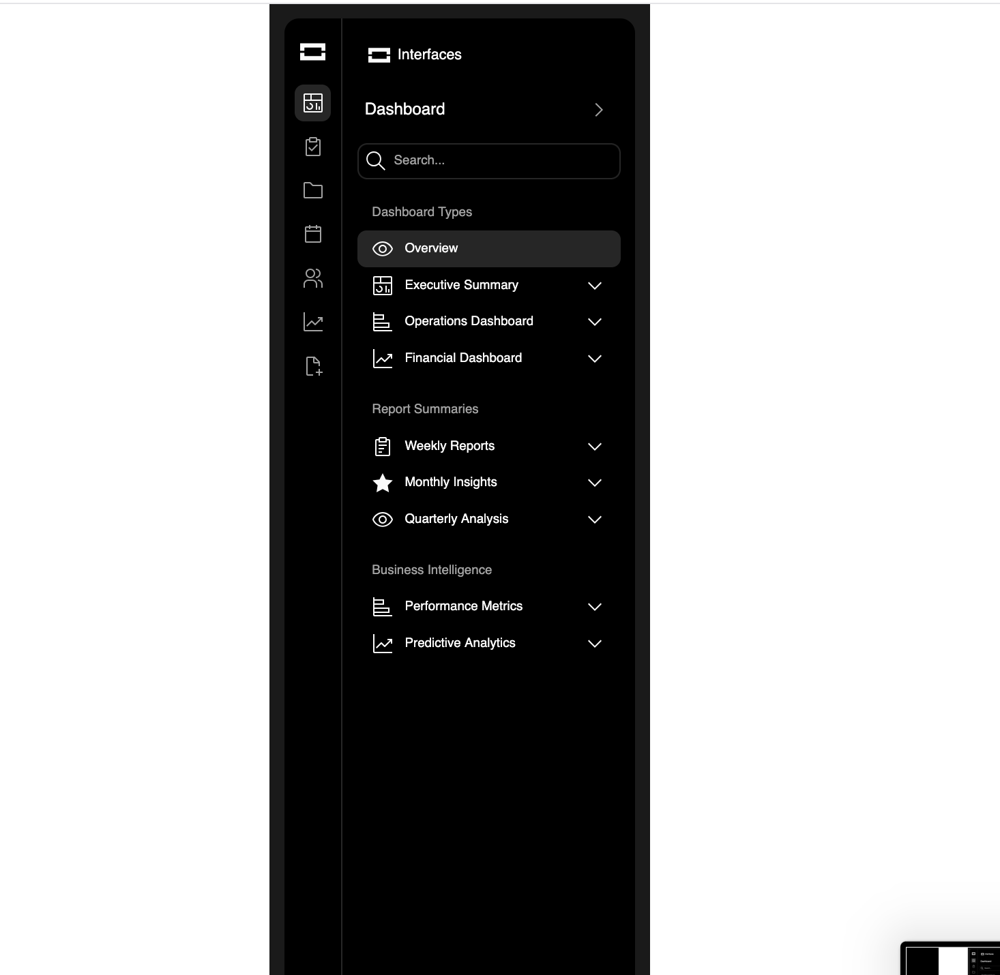

- **Borrow**: the two-tier rail (a slim icon-only rail plus a wider contextual panel that expands per selected icon) as a candidate desktop shell for a capability-gated nav with several top-level areas (Mi Trabajo/Servicios/Inventario/Control Ambiental/Mapa/Catálogo/Tableros) each carrying its own sub-list; grouped, labeled sections within the panel (`Dashboard Types`, `Report Summaries`, `Business Intelligence`) mirror the shape of M6's settled IA groups.
- **Avoid**: chevron-expand-per-item nesting this deep — M6's IA (per [issue #7](https://github.com/hllous/Frontend-M6-DAPS2/issues/7)) is flatter than this; the near-black-on-black contrast would need real rework to clear WCAG 2.2 AA.
- **Likely landing spot**: a candidate structure for the desktop map-and-table workspace's shell — one of the "structurally distinct" variants this ticket is building.

### [`breadcrumb-1.png`](breadcrumb-1.png) — home-icon breadcrumb
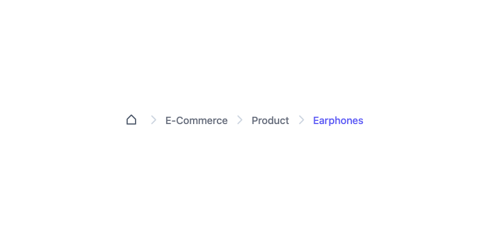

- **Borrow**: leading home icon, `>` chevron separators, final (current) crumb bolded/colored. Direct, low-risk pattern.
- **Avoid**: nothing notable — this is close to final as-is, just needs recoloring to navy/coral instead of indigo.
- **Likely landing spot**: every detail view's header (e.g. `Servicios / Zona 4 / Service #123`).

## Status and progress

### [`stepper-1.png`](stepper-1.png) — vertical timeline stepper
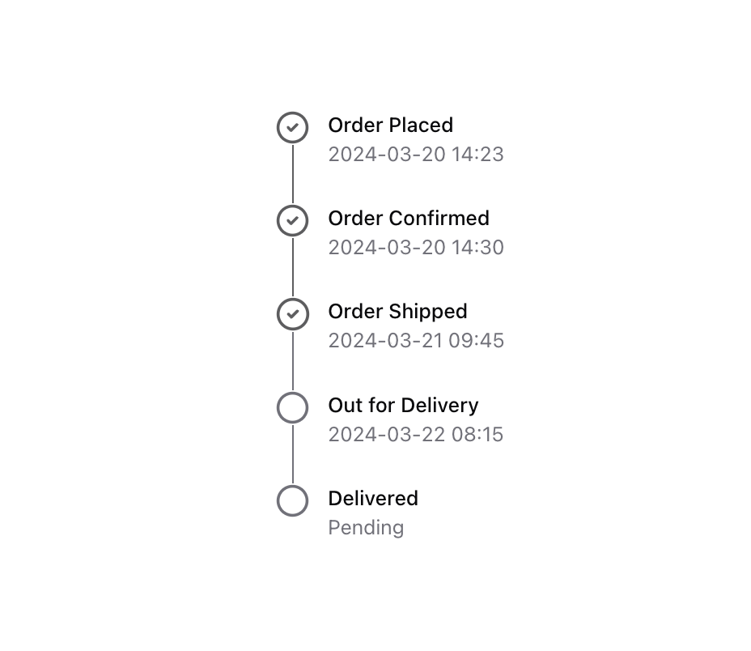

- **Borrow**: near-exact fit for a Service status timeline — filled check-circle for done steps, empty circle for pending, a connecting line, and a timestamp under each label. High priority: this is very close to what a Service detail view needs for SCHEDULED → ASSIGNED → IN_PROGRESS → SERVICED/COMPLETED (and exception timestamps).
- **Avoid**: nothing structural; just needs the M6 status vocabulary and coral for a SUSPENDED/CANCELLED branch state.
- **Likely landing spot**: Service detail view's status history.

### [`badge-1.png`](badge-1.png) — semantic status pills
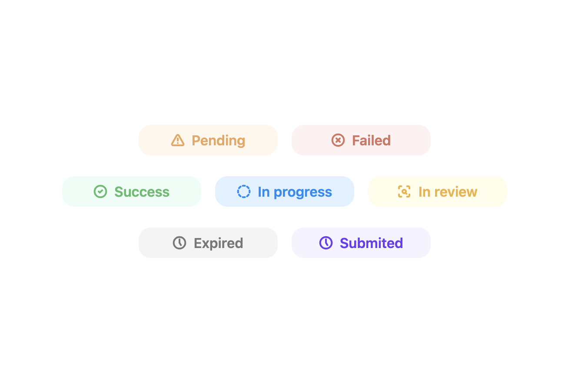

- **Borrow**: pill badges with an icon + label, pastel background + saturated text per status (Pending amber, Failed red, Success green, In progress blue with a spinning dashed-circle icon, In review yellow, Expired gray, Submitted purple). This maps almost one-to-one onto Service status vocabulary and sync states (draft/retrying/synced) — likely becomes the base spec for M6's status-badge component.
- **Avoid**: nothing structural; recolor the palette to fit navy/coral plus whatever sequential status-color scale gets chosen (this shouldn't reuse coral for anything except genuinely urgent/error states).
- **Likely landing spot**: status badges everywhere a Service, ViolationNotice, or sync state is shown — table rows, cards, detail headers.

### [`badge-2.png`](badge-2.png) — split/compound badges
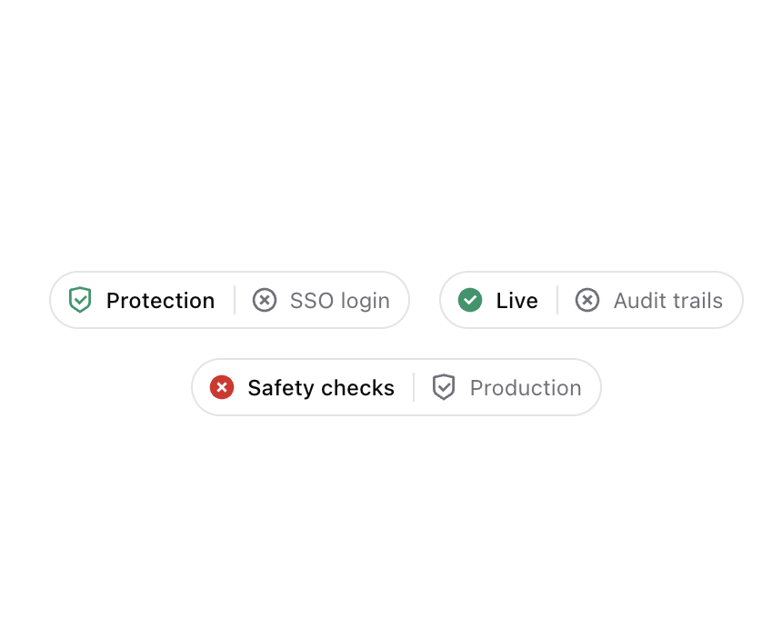

- **Borrow**: a badge split into two icon+label halves joined by a vertical divider (e.g. `Protection | SSO login`) — a candidate for pairing a capability flag with a qualifier (e.g. `Evidence | Required`).
- **Avoid**: lower priority than badge-1; don't let compound badges multiply into a second competing status-pill language.
- **Likely landing spot**: secondary/qualifier tags, if needed — not the primary status vocabulary.

## Feedback and loading

### [`notification-alert-1.png`](notification-alert-1.png) — inline alert card
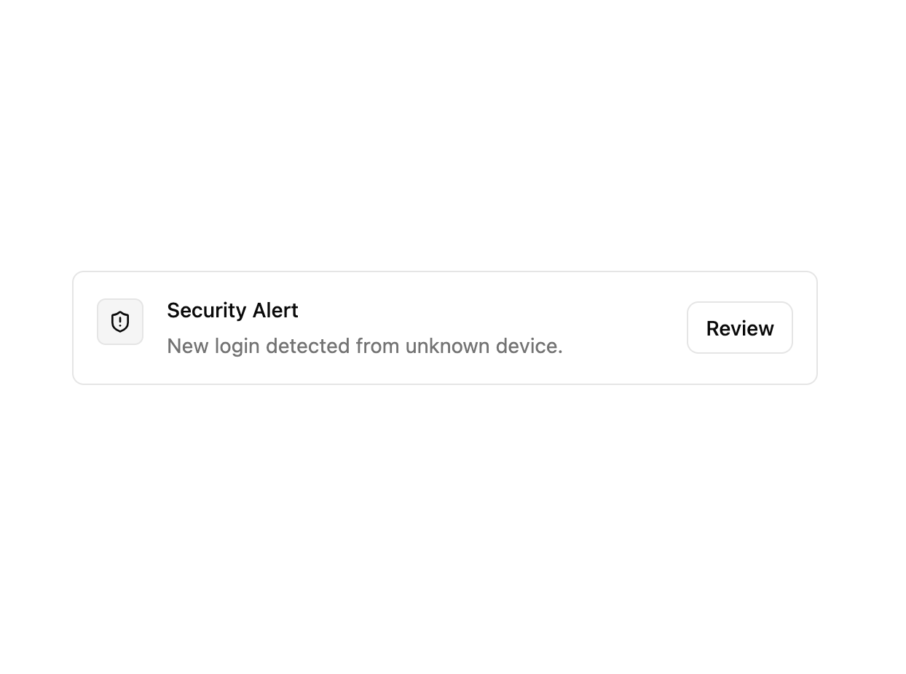

- **Borrow**: bordered, neutral inline alert — icon chip + title + description + a single right-aligned action button. Direct fit for the "Delayed notice" / "Conflict alert" inline banners already decided in the [information architecture](https://github.com/hllous/Frontend-M6-DAPS2/issues/7) (surfaced on the Service itself, no notification center).
- **Also captured**: a `sonner` + `next-themes` Toaster wrapper snippet (shadcn-style) — a real code reference, not just a visual one, worth adopting directly for global toasts (save confirmations, sync status, session-expiry warnings) once the component library is scaffolded.
- **Avoid**: the sample is monochrome/neutral only — needs a coral-bordered or coral-icon variant for actual error/urgent severity, and a navy or green variant for informational/success, so severity is legible without reading the copy.
- **Likely landing spot**: inline Service-level alerts; global toast system.

### [`loader-1.png`](loader-1.png) — skeleton/shimmer card


- **Borrow**: exact skeleton-loading structure (avatar circle + two header lines + three body lines + a large media block) for card/list loading states while TanStack Query resolves.
- **Avoid**: nothing structural.
- **Likely landing spot**: any list/card view's pending state — this was an explicit open question (loading/errors) in ticket #14's own prompt.

## Charts and stats

### [`charts-stats-1.png`](charts-stats-1.png) — 4-up KPI stat-card row
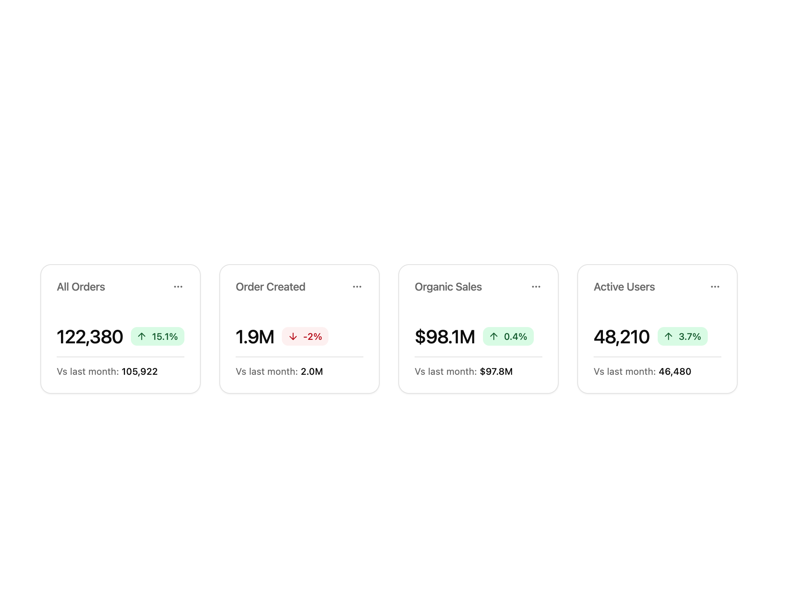

- **Borrow**: exact card structure — label + `...` menu, large number, colored delta pill, divider, `Vs last month: X` caption. Clean template for a Tableros KPI row or a per-zone/per-Crew summary row.
- **Likely landing spot**: Tableros; zone/Crew summary panels.

### [`charts-stats-2.png`](charts-stats-2.png) — compact trend chips
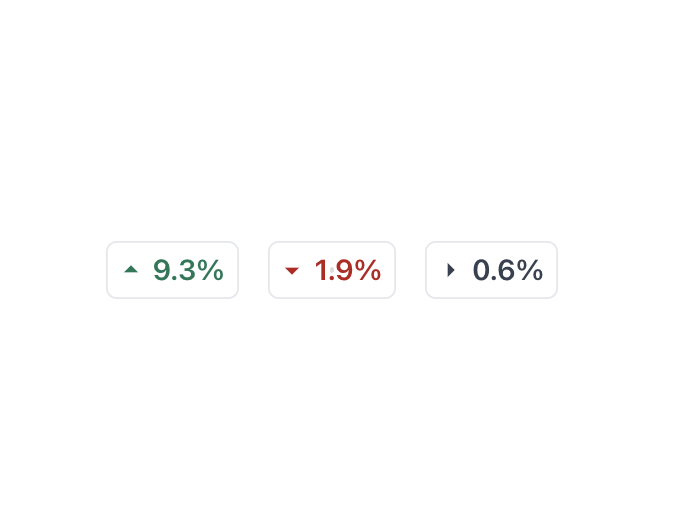

- **Borrow**: small bordered chip with a triangle up/down/neutral icon plus a percentage — a tighter alternative to the badge-1 pill for a dense table cell where a full pill doesn't fit.
- **Likely landing spot**: inline table cells, secondary metrics.

### [`charts-stats-3.png`](charts-stats-3.png) — contribution-style heatmap
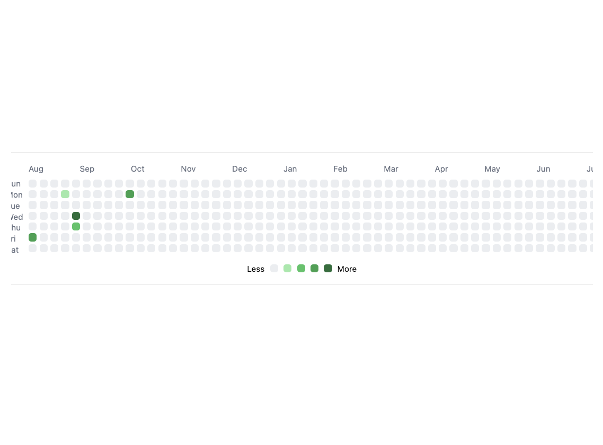

- **Borrow**: GitHub-style day-of-week × month density heatmap with a "Less…More" legend — a candidate for visualizing Service scheduling density or Crew activity over time on a Tableros view.
- **Avoid**: the green sequential scale is a data-viz choice, not a brand color — keep it distinct from (never confused with) any status-badge green.
- **Likely landing spot**: Tableros, scheduling-density view.

### [`charts-stats-4.png`](charts-stats-4.png) — dense inline analytics table
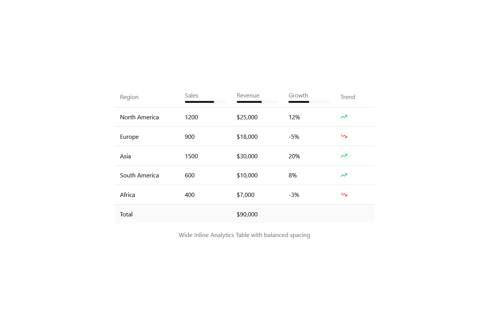

- **Borrow**: strong, direct precedent for the Servicios list/table view — region/sales/revenue/growth/trend-arrow columns, small inline progress bars in the header, a shaded totals row. High priority reference for the table half of the map+table workspace this ticket is prototyping.
- **Likely landing spot**: the Servicios table pane itself.

### [`charts-stats-5.png`](charts-stats-5.png) — multi-series area chart with stacked tooltip
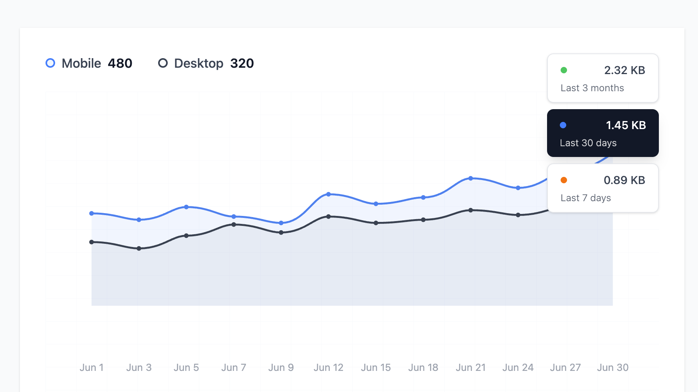

- **Borrow**: dual-series comparison chart (Mobile vs Desktop) with a distinctive stacked-tooltip showing three period callouts (3 months/30 days/7 days), one highlighted as active. Candidate for comparing Office vs Field activity, or Service volume trends.
- **Avoid**: the triple-stacked tooltip is elaborate — likely more than an MVP prototype needs; note it as a stretch idea, not a baseline.
- **Likely landing spot**: Tableros trend charts (lower priority / stretch).

### [`charts-stats-6.png`](charts-stats-6.png) — actual-vs-goal dual-line chart
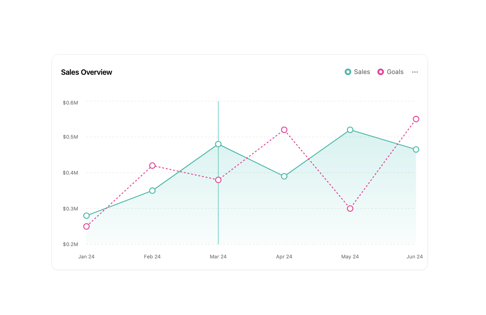

- **Borrow**: solid "Sales" line vs dashed "Goals" line, open-circle markers, filled area under the actual series, a vertical reference line at one point. Direct fit for an actual-vs-target completion or productivity chart.
- **Likely landing spot**: Tableros — Crew productivity or completion-rate-vs-target.

### [`charts-stats-7.png`](charts-stats-7.png) — "Incident Report" card
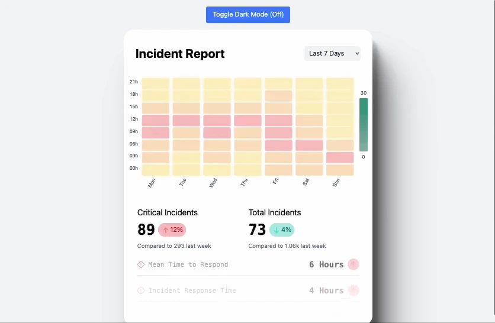

- **Borrow**: near-direct template for a Control Ambiental / exception-monitoring dashboard — an hour-of-day × day-of-week severity heatmap with a small vertical color-scale legend, plus large stat callouts (Critical/Total Incidents with trend pills and "Compared to X last week" captions) and metric rows with small circular trend-icon chips (Mean Time to Respond, Incident Response Time). High priority — this is close to a ready-made spec for a ViolationNotice/EnvironmentalReport monitoring view.
- **Likely landing spot**: Control Ambiental dashboard; Tableros.

### [`charts-stats-8.png`](charts-stats-8.png) — "Incident Resolution Trend" card
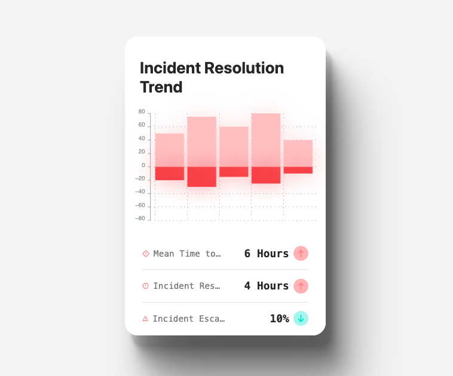

- **Borrow**: same card shell as charts-stats-7 but with a floating min/max range bar chart per day instead of a heatmap — candidate for showing response-time variance per day alongside the same MTTR-style metric rows.
- **Likely landing spot**: paired with charts-stats-7 on the same Control Ambiental dashboard, as an alternate/companion chart.

## Icon libraries named (not yet evaluated)

The user named these as candidate icon sources, unevaluated against WCAG/consistency requirements yet: itshover.com/icons, web.iconly.pro, nucleoapp.com, iconsax.io, isocons.app, hugeicons.com, morphicons.com, lucide-animated.com, movingicons.dev/icons. Picking one (or confirming Lucide, already a common Radix/shadcn default) is an open decision for the grilling frontier — a mixed icon language across dashboard, badge, and alert components would break the "recognizable with all content removed" bar new-work.md sets for a committed visual world.

## Not yet catalogued

The user has more references beyond this batch, noted as high-effort to gather; treat this catalog as v1, not final. Revisit when a second batch arrives.
